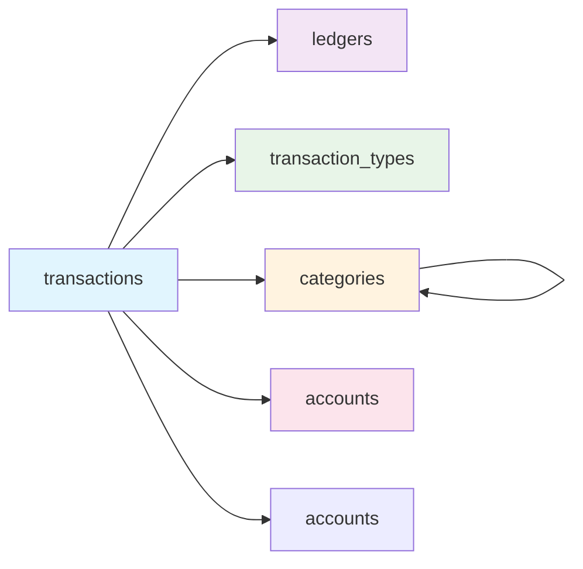

# Jingzhe 数据库设计文档

## 数据库概述

Jingzhe 是一个个人记账系统的数据库，用于管理用户的收支记录、账户信息、分类体系等。

## 表结构详细说明

### 1. **ledgers（账本表）**

用于管理不同的记账场景

| 字段名        | 数据类型    | 约束                                                  | 说明                                    |
| :------------ | :---------- | :---------------------------------------------------- | :-------------------------------------- |
| `ledger_id`   | INT         | PRIMARY KEY, AUTO_INCREMENT                           | 账本唯一标识，主键，自动增长            |
| `ledger_name` | VARCHAR(50) | NOT NULL, UNIQUE                                      | 账本名称（如：个人账本、家庭账本）      |
| `description` | TEXT        | NULL                                                  | 账本描述信息                            |
| `is_active`   | BOOLEAN     | DEFAULT TRUE                                          | 是否启用该账本（TRUE=启用，FALSE=停用） |
| `created_at`  | TIMESTAMP   | DEFAULT CURRENT_TIMESTAMP                             | 记录创建时间，自动设置为当前时间        |
| `updated_at`  | TIMESTAMP   | DEFAULT CURRENT_TIMESTAMP ON UPDATE CURRENT_TIMESTAMP | 记录最后更新时间，修改时自动更新        |

### 2. **accounts（账户表）**

管理各种资金账户

| 字段名            | 数据类型      | 约束                                                  | 说明                                                |
| :---------------- | :------------ | :---------------------------------------------------- | :-------------------------------------------------- |
| `account_id`      | INT           | PRIMARY KEY, AUTO_INCREMENT                           | 账户唯一标识，主键                                  |
| `account_name`    | VARCHAR(50)   | NOT NULL, UNIQUE                                      | 账户名称（如：支付宝、招商银行卡）                  |
| `account_type`    | ENUM          | NOT NULL                                              | 账户类型：现金/银行卡/信用卡/电子支付/投资账户/其他 |
| `initial_balance` | DECIMAL(12,2) | DEFAULT 0.00                                          | 账户初始余额                                        |
| `current_balance` | DECIMAL(12,2) | DEFAULT 0.00                                          | 账户当前余额（可根据交易自动计算）                  |
| `currency`        | VARCHAR(10)   | DEFAULT 'CNY'                                         | 货币类型，默认CNY（人民币）                         |
| `is_active`       | BOOLEAN       | DEFAULT TRUE                                          | 账户是否启用                                        |
| `created_at`      | TIMESTAMP     | DEFAULT CURRENT_TIMESTAMP                             | 创建时间                                            |
| `updated_at`      | TIMESTAMP     | DEFAULT CURRENT_TIMESTAMP ON UPDATE CURRENT_TIMESTAMP | 最后更新时间                                        |

### 3. **categories（分类表）**

管理收支分类，支持无限级分类

| 字段名          | 数据类型     | 约束                        | 说明                                             |
| :-------------- | :----------- | :-------------------------- | :----------------------------------------------- |
| `category_id`   | INT          | PRIMARY KEY, AUTO_INCREMENT | 分类唯一标识，主键                               |
| `category_name` | VARCHAR(50)  | NOT NULL                    | 分类名称（如：餐饮、购物）                       |
| `parent_id`     | INT          | FOREIGN KEY, NULL           | **父分类ID**：NULL表示一级分类，有值表示二级分类 |
| `category_type` | ENUM         | NOT NULL                    | 分类类型：支出/收入/转账                         |
| `icon`          | VARCHAR(100) | NULL                        | 分类图标（用于前端显示）                         |
| `sort_order`    | INT          | DEFAULT 0                   | 排序序号，数字越小排越前                         |
| `is_active`     | BOOLEAN      | DEFAULT TRUE                | 分类是否启用                                     |
| `created_at`    | TIMESTAMP    | DEFAULT CURRENT_TIMESTAMP   | 创建时间                                         |

### 4. **transaction_types（交易类型表）**

定义交易的基本类型

| 字段名        | 数据类型     | 约束                        | 说明                              |
| :------------ | :----------- | :-------------------------- | :-------------------------------- |
| `type_id`     | INT          | PRIMARY KEY, AUTO_INCREMENT | 类型唯一标识，主键                |
| `type_name`   | VARCHAR(20)  | NOT NULL, UNIQUE            | 类型名称：支出/收入/转账          |
| `type_code`   | VARCHAR(10)  | NOT NULL, UNIQUE            | 类型代码：EXPENSE/INCOME/TRANSFER |
| `description` | VARCHAR(100) | NULL                        | 类型描述                          |
| `created_at`  | TIMESTAMP    | DEFAULT CURRENT_TIMESTAMP   | 创建时间                          |

### 5. **transactions（交易记录表）**

核心表，记录所有交易明细

| 字段名                | 数据类型      | 约束                                                  | 说明                                                   |
| :-------------------- | :------------ | :---------------------------------------------------- | :----------------------------------------------------- |
| `transaction_id`      | INT           | PRIMARY KEY, AUTO_INCREMENT                           | 交易记录唯一标识，主键                                 |
| `transaction_time`    | DATETIME      | NOT NULL                                              | **交易时间**：交易发生的具体时间                       |
| `ledger_id`           | INT           | FOREIGN KEY, NOT NULL                                 | **账本ID**：外键，关联到ledgers表                      |
| `type_id`             | INT           | FOREIGN KEY, NOT NULL                                 | **交易类型ID**：外键，关联到transaction_types表        |
| `category_id`         | INT           | FOREIGN KEY, NOT NULL                                 | **分类ID**：外键，关联到categories表                   |
| `amount`              | DECIMAL(12,2) | NOT NULL                                              | **交易金额**：正数表示收入，负数表示支出               |
| `account_id`          | INT           | FOREIGN KEY, NOT NULL                                 | **账户ID**：外键，关联到accounts表（资金变动的账户）   |
| `transfer_account_id` | INT           | FOREIGN KEY, NULL                                     | **转账目标账户ID**：仅转账类型使用，记录资金转入的账户 |
| `reimbursement`       | DECIMAL(12,2) | DEFAULT 0.00                                          | **报销金额**：可以报销的金额部分                       |
| `is_reimbursed`       | BOOLEAN       | DEFAULT FALSE                                         | **是否已报销**：TRUE=已报销，FALSE=未报销              |
| `notes`               | TEXT          | NULL                                                  | **备注**：交易的具体说明                               |
| `created_at`          | TIMESTAMP     | DEFAULT CURRENT_TIMESTAMP                             | 记录创建时间                                           |
| `updated_at`          | TIMESTAMP     | DEFAULT CURRENT_TIMESTAMP ON UPDATE CURRENT_TIMESTAMP | 记录最后更新时间                                       |

### 6. **budgets（预算表）** - 可选扩展

用于设置每月预算

| 字段名          | 数据类型      | 约束                                                  | 说明                         |
| :-------------- | :------------ | :---------------------------------------------------- | :--------------------------- |
| `budget_id`     | INT           | PRIMARY KEY, AUTO_INCREMENT                           | 预算记录唯一标识             |
| `ledger_id`     | INT           | FOREIGN KEY, NOT NULL                                 | 账本ID，外键                 |
| `category_id`   | INT           | FOREIGN KEY, NOT NULL                                 | 分类ID，外键                 |
| `budget_amount` | DECIMAL(12,2) | NOT NULL                                              | 预算金额                     |
| `budget_month`  | DATE          | NOT NULL                                              | 预算月份（格式：YYYY-MM-01） |
| `actual_amount` | DECIMAL(12,2) | DEFAULT 0.00                                          | 实际支出金额                 |
| `created_at`    | TIMESTAMP     | DEFAULT CURRENT_TIMESTAMP                             | 创建时间                     |
| `updated_at`    | TIMESTAMP     | DEFAULT CURRENT_TIMESTAMP ON UPDATE CURRENT_TIMESTAMP | 更新时间                     |

## 表关系映射

### 外键关系图





### 关系说明

- **transactions → ledgers**：多对一关系，多条交易记录属于一个账本
- **transactions → transaction_types**：多对一关系，每条交易有一个类型
- **transactions → categories**：多对一关系，每条交易属于一个分类
- **transactions → accounts**：多对一关系，每条交易关联一个资金账户
- **transactions → accounts**：多对一关系（转账目标账户）
- **categories → categories**：自关联，实现多级分类结构

## 视图说明

### 1. **transaction_details（交易详情视图）**

提供与原始表格格式一致的数据展示

sql

```
CREATE OR REPLACE VIEW transaction_details AS
SELECT 
    t.transaction_id,
    t.transaction_time as '时间',
    l.ledger_name as '账本',
    tt.type_name as '类型',
    COALESCE(pc.category_name, c.category_name) as '一级分类',
    CASE WHEN pc.category_id IS NOT NULL THEN c.category_name ELSE NULL END as '二级分类',
    t.amount as '金额',
    a.account_name as '账户',
    t.reimbursement as '报销',
    t.is_reimbursed as '是否已报销',
    t.notes as '备注',
    t.created_at as '记录时间'
FROM transactions t
LEFT JOIN ledgers l ON t.ledger_id = l.ledger_id
LEFT JOIN transaction_types tt ON t.type_id = tt.type_id
LEFT JOIN categories c ON t.category_id = c.category_id
LEFT JOIN categories pc ON c.parent_id = pc.category_id
LEFT JOIN accounts a ON t.account_id = a.account_id
WHERE l.is_active = TRUE AND c.is_active = TRUE AND a.is_active = TRUE
ORDER BY t.transaction_time DESC;
```


### 2. **account_balances（账户余额视图）**

显示各账户的余额情况

sql

```
CREATE OR REPLACE VIEW account_balances AS
SELECT 
    a.account_id,
    a.account_name,
    a.account_type,
    a.initial_balance,
    a.current_balance,
    COALESCE(SUM(t.amount), 0) as '交易总额',
    (a.initial_balance + COALESCE(SUM(t.amount), 0)) as '计算余额'
FROM accounts a
LEFT JOIN transactions t ON a.account_id = t.account_id
WHERE a.is_active = TRUE
GROUP BY a.account_id, a.account_name, a.account_type, a.initial_balance, a.current_balance;
```


## 数据示例

### 交易记录示例

sql

```
-- 这是一条交易记录的含义：
INSERT INTO transactions VALUES (
    NULL,                           -- transaction_id: 自动生成
    '2025-07-29 19:29:00',         -- transaction_time: 2025年7月29日19:29
    1,                             -- ledger_id: 使用"默认账本"
    1,                             -- type_id: 支出类型
    1,                             -- category_id: 餐饮分类
    -22.90,                        -- amount: 支出22.9元
    2,                             -- account_id: 使用支付宝支付
    NULL,                          -- transfer_account_id: 非转账，为空
    0.00,                          -- reimbursement: 无报销金额
    FALSE,                         -- is_reimbursed: 未报销
    '坑德基',                       -- notes: 在肯德基消费
    NOW(),                         -- created_at: 当前时间
    NOW()                          -- updated_at: 当前时间
);
```


### 分类结构示例

| 一级分类 | 二级分类 | 类型 | 说明     |
| :------- | :------- | :--- | :------- |
| 餐饮     | NULL     | 支出 | 一级分类 |
| 餐饮     | 早餐     | 支出 | 二级分类 |
| 餐饮     | 午餐     | 支出 | 二级分类 |
| 购物     | NULL     | 支出 | 一级分类 |
| 购物     | 服装     | 支出 | 二级分类 |
| 工资     | NULL     | 收入 | 一级分类 |

## 索引优化

### 主要索引

- `transactions` 表：交易时间、账本、类型、分类、账户等字段都建立了索引
- `categories` 表：父分类ID、分类类型、排序等字段建立索引
- `accounts` 表：账户类型、状态等字段建立索引

### 性能考虑

- 所有表使用 InnoDB 存储引擎
- 统一字符集为 utf8mb4
- 金额字段使用 DECIMAL(12,2) 保证精度
- 时间字段建立索引支持快速查询

